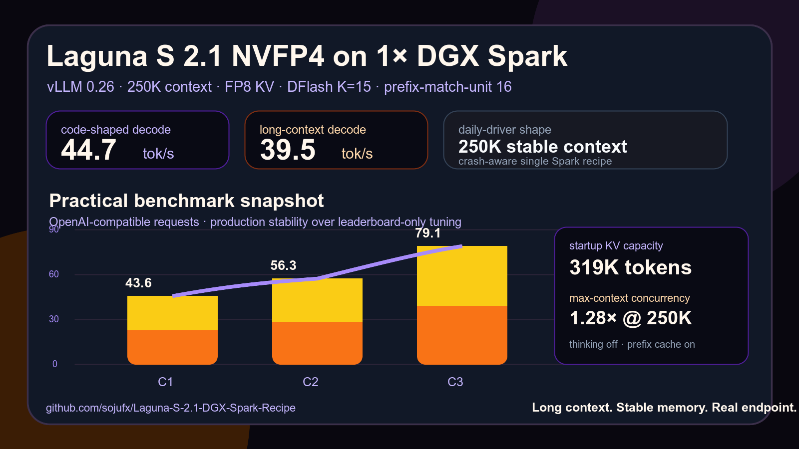

# Laguna S 2.1 NVFP4 on 1x DGX Spark

A practical, crash-aware vLLM recipe for running `poolside/Laguna-S-2.1-NVFP4` on a single NVIDIA DGX Spark / GB10 with 128GB unified memory.

This is not a leaderboard-only configuration. It is the setup I use as a daily-driver production endpoint: long context, stable memory behavior, DFlash speculative decoding, prefix caching, and repeatable OpenAI-compatible benchmarks.

> Long context. Stable memory. Real endpoint.



## What this repo gives you

- 250k context profile for Laguna S 2.1 on one Spark
- vLLM `0.26` serve wrapper
- official Poolside DFlash NVFP4 draft setup
- FP8 KV cache configuration
- prefix cache tuning with `--prefix-match-unit 16`
- systemd autostart template
- smoke test and benchmark scripts
- notes for OOM, slow startup, and power-limited recovery

## Tested profile

```text
Hardware: NVIDIA DGX Spark / GB10 / 128GB unified memory
Runtime: vLLM 0.26
Model: poolside/Laguna-S-2.1-NVFP4
Draft: poolside/Laguna-S-2.1-DFlash-NVFP4
Context: 250,000 tokens
KV cache: fp8
Spec decode: DFlash, K=15
Prefix cache: enabled, prefix-match-unit=16
```

## Benchmark snapshot

| Test | Result |
|---|---:|
| Single code-shaped decode | 44.7 tok/s |
| Single long-context decode | 39.5 tok/s |
| C1 aggregate | 43.6 tok/s |
| C2 aggregate | 56.3 tok/s |
| C3 aggregate | 79.1 tok/s |
| Startup KV cache capacity | 319,138 tokens |
| 250k max-context concurrency estimate | 1.28x |

These are practical production numbers, not leaderboard-tuned claims.

## Quickstart

```bash
git clone https://github.com/sojufx/Laguna-S-2.1-DGX-Spark-Recipe.git
cd Laguna-S-2.1-DGX-Spark-Recipe

export VLLM_API_KEY="change-me"
export VLLM_MODEL="/opt/huggingface/models/Laguna-S-2.1-NVFP4-latest"
export VLLM_DRAFT_MODEL="/opt/huggingface/models/Laguna-S-2.1-DFlash-NVFP4"

./scripts/start-laguna.sh
```

Main production flags:

```bash
--max-model-len 250000
--max-num-seqs 3
--max-num-batched-tokens 2048
--prefix-match-unit 16
--gpu-memory-utilization 0.68
--kv-cache-dtype fp8
--speculative-config '{"model":"...Laguna-S-2.1-DFlash-NVFP4","num_speculative_tokens":15,"method":"dflash","draft_tensor_parallel_size":1}'
```

## Benchmark

```bash
export LLM_BENCH_BASE_URL="http://127.0.0.1:8000/v1"
export LLM_BENCH_API_KEY="$VLLM_API_KEY"
export LLM_BENCH_MODEL="ornith"

python3 scripts/benchmark-laguna.py --concurrency 1,2,3 --max-tokens 512
```

## Why 250k instead of 262k?

250k keeps the large-context behavior while giving a little more KV/cache breathing room.

Observed at startup:

```text
GPU KV cache size: 319,138 tokens
Maximum concurrency for 250,000 tokens/request: 1.28x
Current KV cache memory: ~11.36 GiB
```

## Notes

- Use the official Poolside DFlash NVFP4 draft.
- Keep thinking disabled for lower latency unless a task explicitly needs it.
- `--prefix-match-unit 16` helps repeated agent prefixes / Hermes-style loops.
- Keep `--max-num-batched-tokens 2048` for safer large-prefill behavior on unified memory.
- Keep `CUTE_DSL_ARCH=sm_121a` for GB10 / Spark kernels.
- This is a single-Spark recipe. Two-Spark tensor parallel setups have different tradeoffs.

## Files

- [`scripts/start-laguna.sh`](scripts/start-laguna.sh) — production serve wrapper
- [`scripts/benchmark-laguna.py`](scripts/benchmark-laguna.py) — OpenAI-compatible benchmark suite
- [`systemd/vllm-laguna.service`](systemd/vllm-laguna.service) — systemd template
- [`docs/CONFIG.md`](docs/CONFIG.md) — flag notes
- [`docs/TROUBLESHOOTING.md`](docs/TROUBLESHOOTING.md) — common failures
- [`results/250k-vllm026-dflash-k15.md`](results/250k-vllm026-dflash-k15.md) — benchmark snapshot
